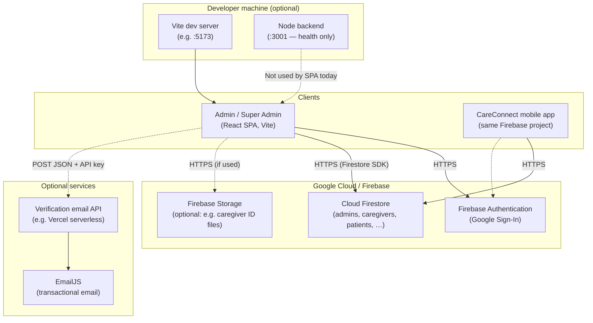
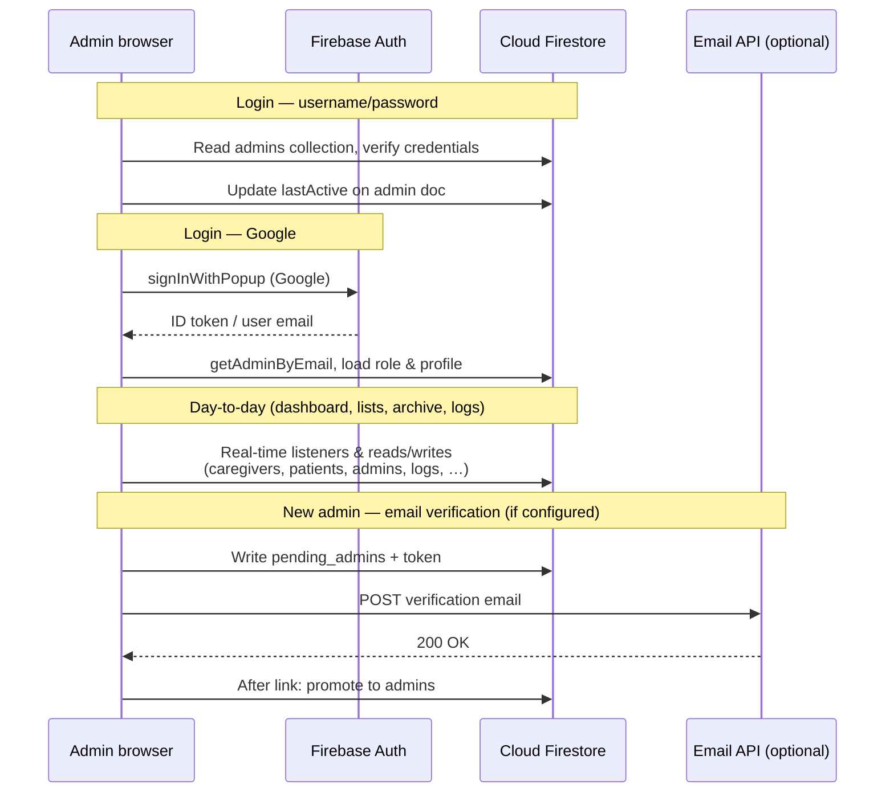
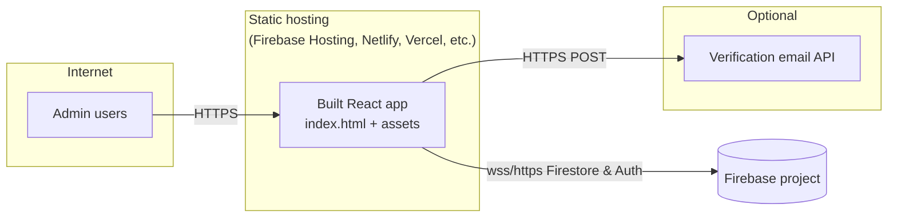

# CareConnect Admin — Network Architecture

This document describes how components of the **CareConnect Admin** project connect over the network. Diagrams use [Mermaid](https://mermaid.js.org/) (render in GitHub, VS Code, or [mermaid.live](https://mermaid.live)).

---

## 1. High-level network view

The admin portal is a **browser-based SPA** that talks mostly **directly to Google Firebase**. A small **Node** server exists for health checks only. Admin verification email may go through an **optional HTTP API** (e.g. on Vercel) to EmailJS.

---

## 2. Data flows (admin portal)

---

## 3. Deployment-style topology

Typical production layout (exact hosts depend on your setup):

---

## 4. Legend

| Connection | Purpose |
|------------|---------|
| **Browser ↔ Firestore** | All admin data: caregivers, patients, admins, archive, connections, logs, pending admins. |
| **Browser ↔ Firebase Auth** | Google OAuth for admins linked by email in Firestore. |
| **Browser ↔ Email API** | Sends admin verification link (`VITE_VERIFICATION_EMAIL_API_URL`). |
| **Node :3001** | Health endpoint only; **not** on the critical path for the React app. |
| **Mobile app ↔ Firestore** | Same project; caregiver/patient docs updated from the field app. |

---

## Environment variables (network-related)

| Variable | Role |
|----------|------|
| `VITE_VERIFICATION_EMAIL_API_URL` | Base URL of the POST endpoint that triggers verification email. |
| `VITE_VERIFICATION_EMAIL_API_KEY` | `X-API-Key` for that API (when required). |

Firebase config is embedded in the frontend (`firebase.js`); Firestore security rules control who can read/write which collections.
